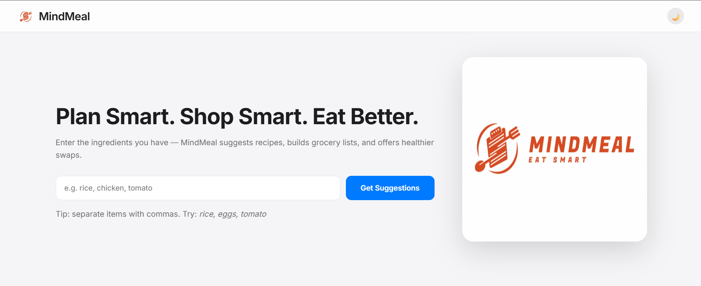

# MindMeal

MindMeal is a meal-planning web app with a static frontend, a FastAPI backend, and JSON-backed data files.

## Project Overview

## Features

## Tech Stack

## Architecture

## Installation

## Deployment

## Screenshots

## Future Improvements
